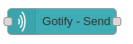

# nr-gotify-push

**NodeRED Node to send Push Notifications via Gotify (self-hosted or cloud)**

Allows to send push mesagesages to android and web. Uses [gotify-Server](https://gotify.net/) as backend. If you do not install your own server a public gotify-server at https://push.tydids.com/ is preconfigured and might be used free of charge.

## Setup (on Server)
- Register for a user account
- Add an application
- Use token within NodeRED Node configuration

## Setup Phone
- Get the latest version of the Gotify App on [Play Store](https://play.google.com/store/apps/details?id=com.github.gotify) or [F-Droid](https://f-droid.org/de/packages/com.github.gotify/)
- Login with the same credentials as on server

## Setup in NodeRED
- Add nr-gotify-push to palett via search and install
- Add a gotify-send to your flow
- Configure it to your needs

## Maintainer / Imprint

<addr>
Thorsten Zoerner   
Gerhard Weiser Ring 29   
69256 Mauer   
Germany   
  
+49 6226 968 009 0   
  
me@thorsten-zoerner.com   
</addr>

Project Website: https://tydids.com/

## LICENSE
[Apache-2.0](./LICENSE)
